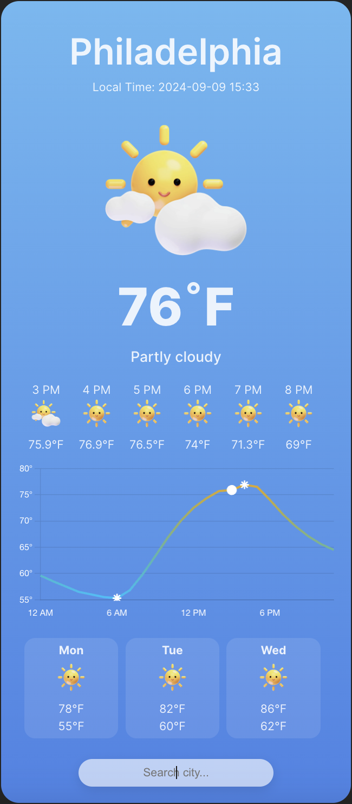
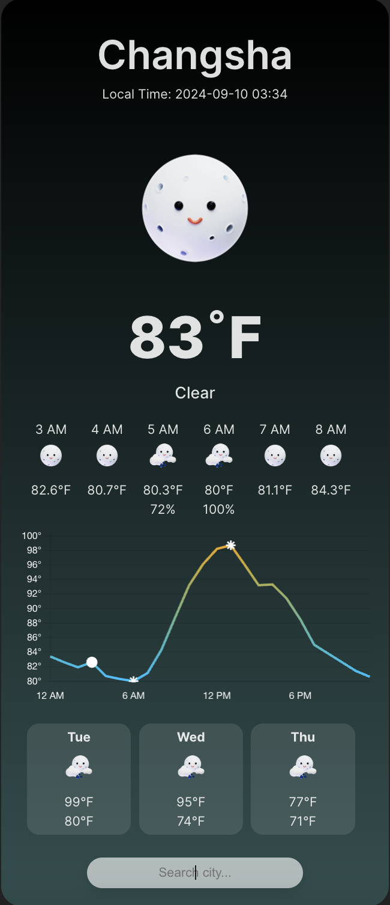

# Weather App

## Overview

This is a weather app built using **React** and **Chart.js**. The app allows users to search for weather forecasts in various cities and displays the current weather, a detailed 7-day forecast, and a temperature chart for the next 24 hours. The data is fetched from the [WeatherAPI](https://www.weatherapi.com/). To integrate with the API, an API key is required. The API provides real-time weather data, including current conditions and forecasts.

### Screenshots

#### Daytime Weather



#### Nighttime Weather




### Features:
- **Search for any city** to get current weather and 7-day forecast.
- **Display of current temperature, weather condition, and local time** for the selected city.
- **Hourly temperature chart** using Chart.js for temperatures over the next 24 hours, highlighting the current time, highest, and lowest points.
- **7-day forecast** including high and low temperatures and weather icons.
- **Dynamic weather icons** that adjust based on day/night conditions and weather types (e.g., sunny, cloudy, rainy).


### How to Set Up the API Key:
1. Go to [WeatherAPI](https://www.weatherapi.com/), sign up, and get an API key.
2. Replace the placeholder API key in the code:
   ```javascript
   const api = {
     key: "YOUR_API_KEY", 
     base: "https://api.weatherapi.com/v1/"
   };
   ```